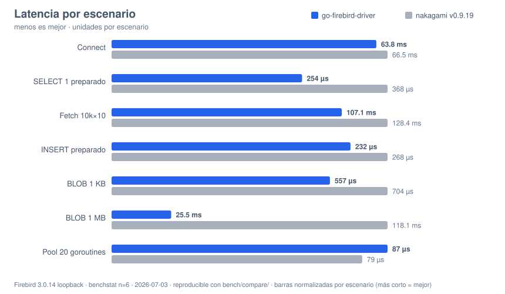
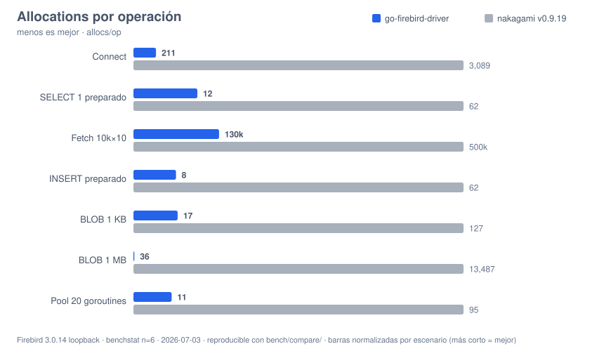

# go-firebird-driver vs nakagami/firebirdsql

Comparación verificada y reproducible entre este driver y
[nakagami/firebirdsql](https://github.com/nakagami/firebirdsql) (el driver Firebird
de facto en Go). Versiones exactas de esta comparación:

- go-firebird-driver: rama `review/pre-1.0` (pre-1.0, 2026-07-03)
- nakagami/firebirdsql: **v0.9.19** (última release publicada al momento de medir)
- Go 1.26.x, Windows/amd64, Firebird 3.0.14 nativo en loopback
- Corrección verificada además contra Firebird 3/4/5 en contenedores

## Matriz de features

Verificada leyendo/ejercitando el código de ambos (no de memoria). ✅ = soportado.

| Feature | go-firebird-driver | nakagami/firebirdsql |
| --- | :-: | :-: |
| Firebird 3.0 / 4.0 / 5.0 | ✅ | ✅ |
| Protocolos wire negociados | 13 / 15 / 16 / **18** | 13 / 16 |
| Autenticación SRP / SRP256 | ✅ | ✅ |
| `Legacy_Auth` (servers legacy) | ❌ (error claro pidiendo SRP) | ✅ |
| Wire encryption ARC4 | ✅ | ✅ |
| Wire encryption ChaCha20 | ✅ | ✅ |
| Wire encryption ChaCha64 | ❌ | ✅ |
| Compresión wire (zlib) | ❌ (decisión 1.0, documentada) | ✅ |
| INT128, DECFLOAT (FB4+) | ✅ | ✅ |
| TIMESTAMP/TIME WITH TIME ZONE (FB4+) | ✅ | ✅ |
| NUMERIC/DECIMAL sin pérdida (string) | ✅ | ✅ |
| Charsets legacy (ISO8859_x, WIN125x, DOS…) | ✅ (fast-path propio en los calientes) | ✅ (x/text) |
| BLOBs (lectura/escritura, >64KB) | ✅ (pipelined: 1 round-trip) | ✅ |
| `driver.DriverContext` / `Connector` | ✅ | ❌ |
| `ColumnType{DatabaseTypeName,Length,Nullable,PrecisionScale,ScanType}` | ✅ | ✅ |
| `SessionResetter` / `Validator` (higiene de pool) | ✅ | ❌ |
| `NamedValueChecker` (validación de params en cliente) | ✅ | ❌ |
| Cancelación por contexto con `op_cancel` real | ✅ asíncrona: interrumpe una op bloqueada en el server (~300ms en la sonda) y la conexión queda reutilizable | ⚠️ se dispara entre operaciones: una op bloqueada corre hasta terminar (19.2s para un deadline de 300ms en la misma sonda, v0.9.19) |
| Cancelación acotada de lock-wait | ✅ (deadline forzado + grace) | ❌ |
| Errores programáticos (código GDS + SQLSTATE) | ✅ `firebird.Error` | ✅ `FbError` |
| Error a mitad de fetch: filas previas + error con GDS | ✅ | ⚠️ (pierde las filas del lote y el código) |
| `LastInsertId` | error explícito (usar `RETURNING`) | devuelve `-1` sin error |
| Events (`POST_EVENT`) | ❌ fuera de alcance 1.0 | ✅ |
| Services API (backup/restore/maintenance) | ❌ fuera de alcance 1.0 | ✅ |
| Tabla de mensajes de error embebida | ✅ (2969 templates) | ✅ |

Fuera de alcance 1.0 con justificación (`COMPATIBILITY.md`): events, services, compresión
wire, `Legacy_Auth`, scrollable cursors, arrays. Si tu aplicación depende de events o de
la services API, nakagami es hoy la opción para esas partes.

## Corrección head-to-head

- **37 bases de datos de producción reales** (dialecto 1 y 3, charsets ISO8859_1 / NONE /
  UTF8 / UNICODE_FSS, 663 tablas, ~97k filas muestreadas): ambos drivers escanean
  **valores idénticos fila por fila** (0 discrepancias).
- Edge cases (misma sonda contra ambos): NUMERIC(18,4) en MinInt64, VARCHAR(32765) al
  máximo, string vacía vs NULL, blob de 0 bytes, wall-clock de TIMESTAMP con zona no-UTC,
  UTF8 con ñ/€: **idénticos en ambos**.
- Diferencias de contrato observadas (ninguna es corrupción de datos): ver la matriz —
  error a mitad de fetch, `LastInsertId`, y validación de parámetros en cliente
  (uint64 desbordado / string basura a DOUBLE: los dos fallan, nosotros antes de tocar la
  red y con mensaje del driver; nakagami con el error -303 del servidor).

## Performance head-to-head

Harness reproducible en [`bench/compare/`](bench/compare/README.md): mismos escenarios,
mismo servidor, mismos datos, `benchstat` con n=6 (p=0.002 salvo indicado).

| Escenario | go-firebird-driver | nakagami v0.9.19 | Tiempo | Allocs |
| --- | ---: | ---: | ---: | ---: |
| Connect (SRP+attach+detach) | 63.8 ms · 211 allocs | 66.5 ms · 3,089 allocs | empate (p=0.18) | **14.6× menos** |
| `SELECT 1` preparado | 254 µs · 12 allocs | 368 µs · 62 allocs | **1.45× más rápido** | **5.2× menos** |
| Fetch 10k filas × 10 cols | 107.1 ms · 130k allocs | 128.4 ms · 500k allocs | **1.20× más rápido** | **3.9× menos** |
| INSERT preparado (tx por lote) | 232 µs · 8 allocs | 268 µs · 62 allocs | **1.15× más rápido** | **7.8× menos** |
| BLOB 1 KB | 557 µs · 17 allocs | 704 µs · 127 allocs | **1.26× más rápido** | **7.5× menos** |
| BLOB 1 MB | 25.5 ms · 36 allocs | 118.1 ms · 13,487 allocs | **4.6× más rápido** | **375× menos** |
| Pool 20 goroutines | 87 µs · 11 allocs | 79 µs · 95 allocs | **nakagami 1.10× más rápido** | **8.6× menos** |

Resumen honesto: **más rápidos en 5 de 7 escenarios, empate en Connect, y nakagami gana
Pool20 por ~10%** (verificado con corridas intercaladas; está en nuestro backlog).
En memoria: **menos allocations en los 7 escenarios** (geomean 12.7×) y menos bytes en
6 de 7. Menos allocations = menos presión de GC bajo carga sostenida.





Nota de transparencia: nakagami mejoró notablemente de v0.9.15 a v0.9.19 (p.ej.
`SELECT 1` de 802µs a 368µs). Esta tabla usa la última release; los números viejos de
v0.9.15 quedan solo en los informes internos de `review/`.

## Reproducir

```sh
cd bench/compare
go test -run '^$' -bench . -benchmem -count=6 . > ours.txt
go test -run '^$' -bench . -benchmem -count=6 -tags nak . > nak.txt
benchstat ours.txt nak.txt
```

Requiere una base dedicada (ver `bench/compare/README.md`). La comparación de corrección
sobre bases reales usa el barrido documentado en `review/03-phase2-completion.md`.

## Migración

Guía completa en [MIGRATION.md](MIGRATION.md) — el alias `firebirdsql` ya registrado y el
DSN compatible hacen que la mayoría de las aplicaciones migren cambiando solo el import.
